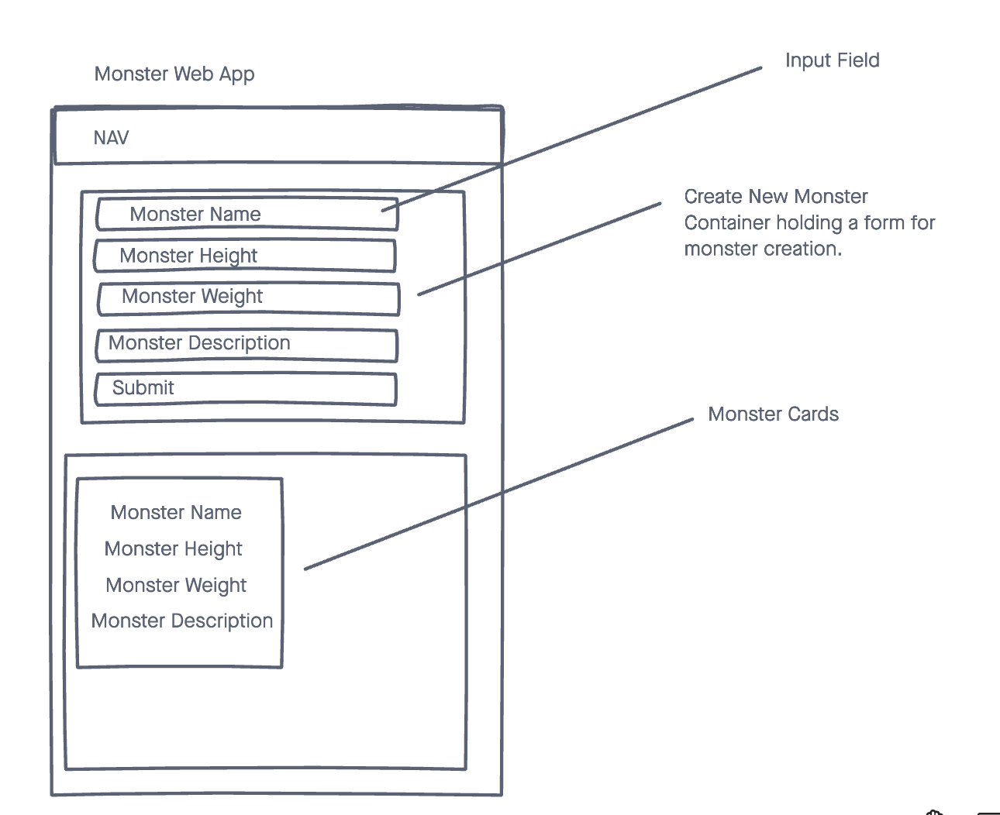

# Monster APP

A simple web app API that stores information on monsters that are created by users on the client side. Contains various attributes such as names, weight, height, and description.

---

## Technologies Used

- React
- Heroku

---

## Approach Taken

For this project we took an Agile development approach. Working as a team we divided ourselves into different roles. 

- Breanna Lunsford as Release Manager

Breanna managed the Main branch, facilitated code reviews, and managed pull requests. 

- Cameron Nguyen as Lead Backend Developer

Cameron oversaw the development of the Rails backend API and database development.

- Brandon Myers as Lead Frontend Developer and Product Manager

Brandon oversaw the development of the React frontend that pulled and pushed data with our Rails API. As Product Manager Brandon prioritized efforts and features for the web application. 

---

## Trello Board for Project Management

[Trello Link](https://trello.com/b/JqiSXzQ1/project-4)

---

## Screenshots of Planning Phase

#### Wireframe Mockup

---

## Link to Frontend Repository

[Monster Maker Frontend Repo](https://github.com/TechAlchemist/monster_client)

---

## Link to Live Deployment 

[Monster Maker](https://monster-client-frontend.herokuapp.com/)

